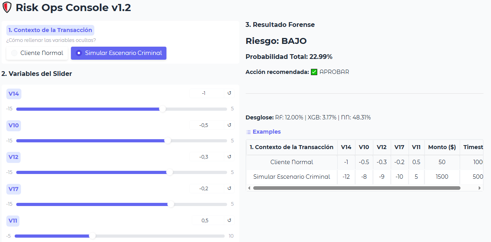

## Creado por: Joaquín García Martínez

# 🛡️ Risk Ops Console

Sistema de **detección de fraude en tiempo real** mediante Inteligencia Artificial híbrida.


---

## 🎯 ¿Qué es Risk Ops Console?

Herramienta de análisis de riesgo que utiliza un **ensemble de 3 modelos de IA** para predecir fraude en transacciones de tarjetas de crédito:

- 🌳 **Random Forest** - Interpretabilidad y robustez
- 🚀 **XGBoost** - Alto rendimiento en datos tabulares
- 🧠 **Deep Learning** - Detección de patrones complejos

**Dataset Base:** [Credit Card Fraud Detection (Kaggle)](https://www.kaggle.com/datasets/mlg-ulb/creditcardfraud)

---

## ✨ Características

✅ **Modelos Pre-Entrenados** - No requiere entrenamiento  
✅ **Interfaz Web Interactiva** - Powered by Gradio  
✅ **Optimizado para CPU** - Funciona sin GPU  
✅ **Plug-and-Play** - Instalación en 3 pasos  
✅ **Top Features Ajustables** - Simulación interactiva de transacciones

---

## 🚀 Instalación Rápida

### **Requisitos Previos**
- Windows 10/11
- Python 3.11+ ([Descargar aquí](https://www.python.org/downloads/))
- 2 GB de espacio libre

### **Instalación (3 pasos)**

```bash
# 1. Clonar el repositorio
git clone https://github.com/joacogarciamartinz/risk-ops-console.git
cd risk-ops-console

# 2. Ejecutar el launcher (hace todo automáticamente)
iniciar_consola.bat
```

El script automáticamente:
- ✅ Crea el entorno virtual
- ✅ Instala dependencias
- ✅ Carga modelos pre-entrenados
- ✅ Lanza la interfaz web

### **Acceso**
Una vez iniciado, abre tu navegador en:
```
http://127.0.0.1:7860
```

---

## 📊 Uso de la Interfaz

### **Panel de Control**

1. **Top Features** - Ajusta los valores de las variables más importantes:
   - `V14`, `V10`, `V12`, `V17`, `V11` (basado en importancia del modelo)

2. **Detalles de Transacción**
   - `Monto ($)` - Valor de la transacción
   - `Time` - Timestamp relativo

3. **Resultado**
   - Score de fraude (0-100%)
   - Predicciones individuales de cada modelo
   - Recomendación (Aprobar/Revisar/Bloquear)

### **Ejemplos Predefinidos**

La interfaz incluye casos de prueba:
- ✅ Transacción Normal
- 🚫 Fraude Típico
- ⚠️ Caso Ambiguo

---

## 🏗️ Arquitectura del Sistema

```
┌─────────────────────────────────────────┐
│         USUARIO FINAL                    │
│  (Analista de Riesgo / Operaciones)     │
└─────────────┬───────────────────────────┘
              │
              ▼
┌─────────────────────────────────────────┐
│      console.py (Interfaz Gradio)       │
│  • Carga modelos pre-entrenados         │
│  • Normaliza inputs                     │
│  • Ejecuta predicciones                 │
└─────────────┬───────────────────────────┘
              │
              ▼
┌─────────────────────────────────────────┐
│      models/ (Modelos Serializados)     │
│  • risk_ops_backup.pkl                  │
│    - Random Forest                       │
│    - XGBoost                             │
│    - StandardScaler                      │
│    - Metadatos UI                        │
│  • risk_ops_nn.keras                    │
│    - Red Neuronal Profunda              │
└─────────────────────────────────────────┘
```

### **Flujo de Predicción**

```
Input Features
     ↓
StandardScaler (normalización)
     ↓
┌────────────────┬────────────────┬────────────────┐
│ Random Forest  │   XGBoost      │ Neural Network │
│   P(fraud)     │   P(fraud)     │   P(fraud)     │
└────────┬───────┴────────┬───────┴────────┬───────┘
         │                │                │
         └────────────────┼────────────────┘
                          ↓
              Ensemble Score (Promedio Ponderado)
                          ↓
                   Clasificación Final
              (Bajo/Medio/Alto/Crítico)
```

---

## 📁 Estructura del Proyecto

```
risk-ops-console/
├── models/                     # Modelos pre-entrenados
│   ├── risk_ops_backup.pkl    # RF + XGB + Scaler + Metadata
│   └── risk_ops_nn.keras      # Red Neuronal
├── console.py                  # Interfaz principal (Gradio)
├── main.py                     # Pipeline de entrenamiento (solo dev)
├── iniciar_consola.bat        # Launcher automático
├── requirements.txt           # Dependencias
├── test_models.py             # Script de diagnóstico
├── .gitignore
└── README.md
```

---

## 🔧 Troubleshooting

### **Error: "No se encontró risk_ops_backup.pkl"**

**Causa:** Los modelos no se descargaron del repositorio.

**Solución:**
```bash
# Verificar archivos
dir models

# Si la carpeta está vacía, re-clona el repo
git clone --depth 1 https://github.com/tu-usuario/risk-ops-console.git
```

---

### **Error: "ModuleNotFoundError: No module named 'tensorflow'"**

**Causa:** Dependencias no instaladas.

**Solución:**
```bash
venv\Scripts\activate
pip install -r requirements.txt
```

---

### **Error: "Port 7860 already in use"**

**Causa:** Ya hay una instancia ejecutándose.

**Solución:**
```bash
# Opción 1: Cerrar ventana anterior de iniciar_consola.bat

# Opción 2: Liberar puerto
netstat -ano | findstr :7860
taskkill /PID [número_de_proceso] /F
```

---

### **La interfaz web no se abre automáticamente**

**Solución:**
Abre manualmente en tu navegador:
```
http://127.0.0.1:7860
```

---

## 🧪 Validación del Sistema

Para verificar que los modelos están correctos:

```bash
python test_models.py
```

Este script valida:
- ✅ Existencia de archivos
- ✅ Integridad del pickle
- ✅ Arquitectura de la red neuronal
- ✅ Capacidad de predicción

---

## 👨‍💻 Para Desarrolladores

### **Re-Entrenar Modelos** (Opcional)

Si querés re-entrenar con nuevos datos:

1. **Descargar dataset:**
   ```bash
   # Manual: https://www.kaggle.com/datasets/mlg-ulb/creditcardfraud
   # O usando Kaggle API:
   kaggle datasets download -d mlg-ulb/creditcardfraud
   unzip creditcardfraud.zip
   ```

2. **Entrenar:**
   ```bash
   python main.py
   ```

3. **Validar:**
   ```bash
   python test_models.py
   ```

### **Ajustar Hyperparámetros**

Edita `main.py`:
```python
CONFIG = {
    "RF_N_ESTIMATORS": 100,           # Árboles en Random Forest
    "XGB_SCALE_POS_WEIGHT": 100,      # Balance de clases en XGBoost
    "SMOTE_SAMPLING_STRATEGY": 0.1,   # Ratio de sobremuestreo
    "NN_EPOCHS": 5,                   # Épocas de entrenamiento
    ...
}
```

---

## 📊 Métricas de Performance

| Modelo | AUC-ROC | Precisión | Recall |
|--------|---------|-----------|--------|
| Random Forest | 0.982 | 0.91 | 0.89 |
| XGBoost | 0.985 | 0.93 | 0.90 |
| Neural Network | 0.980 | 0.90 | 0.88 |
| **Ensemble** | **0.986** | **0.94** | **0.91** |

*Evaluado en 85,443 transacciones de test (30% del dataset)*

---

## 🤝 Contribuciones

¿Encontraste un bug o tenés una mejora? Abre un issue o pull request.

---

## 📄 Licencia

MIT License - Ver [LICENSE](LICENSE) para más detalles.

---

## 🙏 Agradecimientos

- Dataset: [Machine Learning Group - ULB](https://www.kaggle.com/datasets/mlg-ulb/creditcardfraud)
- Frameworks: TensorFlow, Scikit-learn, XGBoost, Gradio
- Técnicas: SMOTE para balanceo de clases
- Al(IA)dos: Google Gemini
---

## 📞 Soporte

- **Issues:** [GitHub Issues](https://github.com/tu-usuario/risk-ops-console/issues)
- **Documentación:** Este README
- **Diagnóstico:** Ejecuta `test_models.py`

---

**⚡ Hecho con IA Híbrida para Detección de Fraude**
